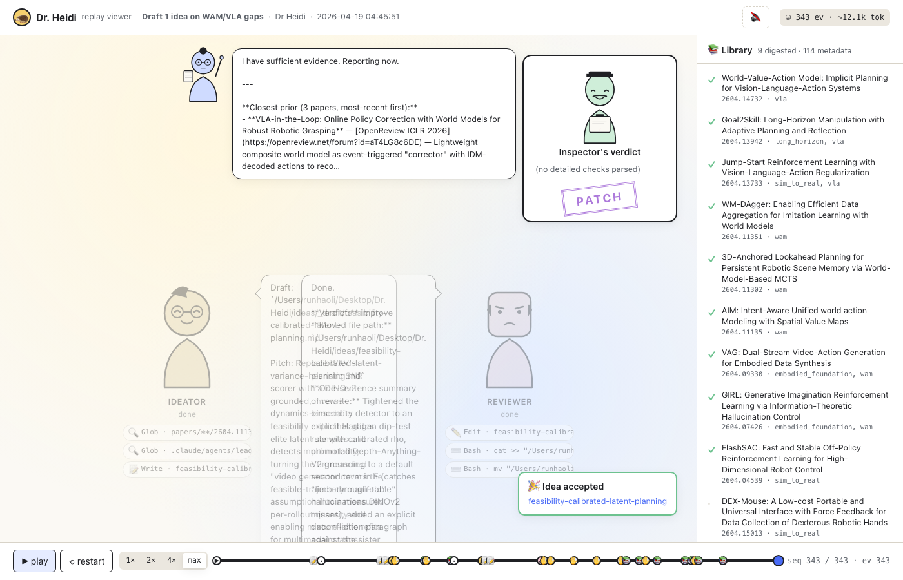
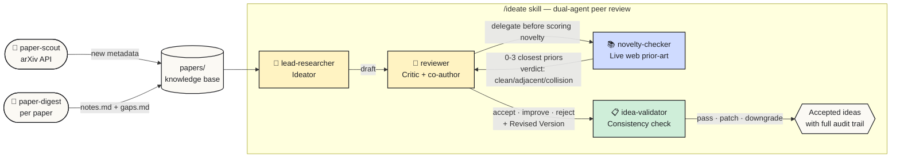

# Dr. Heidi

A four-agent research-idea generator for Embodied AI / Robotics, with internal peer review and a live web-based prior-art check.

Dr. Heidi pulls fresh papers from arXiv, digests them into structured notes, then runs a multi-agent pipeline that drafts novel research ideas and critiques them at a top-tier-conference bar. Every idea reaches you with a verdict, a revision history, a live novelty check against the open web, and a consistency audit. It's the research workflow of a careful PhD student, scripted as four cooperating Claude Code subagents.

The companion **web UI** lets you replay any past run as a watchable two-character drama.


*Replay viewer: Ideator (left) and Reviewer (right) on stage, parallel novelty-checker librarians at top, validator's verdict top-right, paper library on the side.*

---

## What it's for

You're working on Embodied AI / VLA / world-model research. You want to:

- Stay current with arXiv without re-reading every paper
- Generate concrete, falsifiable research-project proposals — not vague directions
- Have someone push back on your ideas before you sink a week into them
- Catch obvious prior-art collisions before submission, not after

Dr. Heidi automates the first three; the fourth via live WebSearch on every idea. Use it as a **first-stage filter and brainstorm partner**, not as an oracle (see [Honest limits](#honest-limits) below).

---

## The four-agent pipeline



**Two main characters** carry the load:

- **`lead-researcher` (Ideator)** — drafts research proposals grounded in the local paper knowledge base. Every idea must cite **≥3 unique recent papers** with role tags (`method-inspiration`, `gap-source`, `baseline`, `enabling-technique`, `data-source`). Outputs a structured proposal: Title, Problem, Core Idea, Approach, Why Now, Expected Contribution, MVE, Risks, Not To Be Confused With.

- **`reviewer` (Critic + co-author)** — peer-reviews each draft against a CVPR/NeurIPS/ICRA bar. Scores Novelty / Impact / Feasibility (1–5 each) and applies a non-trash checklist (already-done / falsifiable / non-trivial / has-MVE / stakeholder-exists). Verdicts: **accept · improve · reject**. For `improve`, the reviewer **rewrites** the flawed parts itself in a `## Revised Version` block — it's a co-author, not just a flagger.

**Two side characters** keep the system honest:

- **`novelty-checker` (Whistleblower)** — the only agent with live web access. Before the reviewer scores Novelty, it runs WebSearch / WebFetch against arXiv and reports the 0–3 closest external priors plus a collision verdict (`clean` / `adjacent` / `direct-collision`). This was added after Round 0 missed real collisions like VLAC and VLA-in-the-Loop using local-KB-only search.

- **`idea-validator` (Referee)** — second-pass consistency check on the reviewer's amended version. Five-point checklist: claim-capability alignment / benchmark fitness / circularity / expected-signal groundedness / Risks↔Approach contradiction. Verdicts: **pass · patch · downgrade-to-reject**. Catches issues the reviewer introduces while fixing the original concerns.

The orchestrator (`ideate` skill) runs `novelty-checker` *first*, then passes its report inline to the `reviewer` — because subagents can't recursively spawn subagents in the current Claude Code runtime.

---

## How to use

Prerequisites: macOS or Linux, Python 3.9+, Claude Code (the CLI), `pdftotext` from Poppler (`brew install poppler`), `curl`.

### One-time setup

```bash
git clone https://github.com/runhaoli-creator/Dr-Heidi.git "Dr. Heidi"
cd "Dr. Heidi"
python3 -m venv .venv
.venv/bin/pip install -r requirements.txt
```

### Daily workflow inside Claude Code

```text
> /paper-scout                # fetch fresh arXiv → papers/<YYYY-MM>/<id>/metadata.json
> /paper-digest 2604.04539    # download PDF, write notes.md + gaps.md
> /ideate                     # run the four-agent pipeline; prompts for scope + count
```

Outputs land in:

- `papers/<YYYY-MM>/<arxiv_id>/` — `metadata.json`, `notes.md`, `gaps.md`
- `ideas/<slug>.md` — accepted ideas with the full audit trail (draft + Review block + Revised Version + Validator block)
- `ideas/_rejected/<slug>.md` — anything the reviewer killed outright (kept for the record so we don't re-propose them)

### Watching past runs as a drama

```bash
./run.sh                      # boots local server, opens http://127.0.0.1:8765
```

The web UI is a replay viewer — pick any past ideation run from your Claude Code history (`~/.claude/projects/`) and watch the four agents talk. Speech bubbles type out at adjustable speed, the librarian sprite walks on with each novelty check (multiplies for parallel batches), and the inspector stamps the final verdict. Click any character to see their full event log; click any paper card to read its digest. See [`docs/WEBUI_BUILD_REPORT.md`](docs/WEBUI_BUILD_REPORT.md) for what's built and what's not.

### Running the arXiv scout directly (without Claude Code)

```bash
.venv/bin/python scripts/arxiv_fetch.py --query-file queries/wam_vla.yaml --max-per-group 30
.venv/bin/python scripts/arxiv_fetch.py --group vla --max-per-group 50
```

Edit `queries/wam_vla.yaml` to change topics. Keywords use `OR` within a group, `AND` across groups. AND/OR semantics are honored in the post-fetch filter (it's a real expression evaluator, not a bag-of-words match).

---

## Example output

After an `/ideate` run, an accepted idea looks like [`ideas/contact-reward-scorer-for-wm-mcts.md`](ideas/contact-reward-scorer-for-wm-mcts.md). Trimmed:

```markdown
---
id: idea-20260418-06
slug: contact-reward-scorer-for-wm-mcts
status: accepted
target_venue: CoRL
citations:
  - arxiv: 2604.11302  role: gap-source
    note: 3D-ALP's monotone kinematic-distance reward only fits reach tasks…
  - arxiv: 2604.11135  role: method-inspiration
    note: AIM's ASVM produces per-pixel contact-affordance heatmaps…
  - arxiv: 2604.07426  role: enabling-technique
    note: GIRL's Distilled Semantic Prior shows a slow signal can be compressed…
---

## Title
Learned Contact-Affordance Scorers for 3D-Anchored World-Model MCTS …

## Core Idea
Use AIM's pretrained Action-based Spatial Value Map as a drop-in non-monotone
scorer for 3D-ALP's MCTS rollouts. The non-obvious move: AIM's ASVM is *trained
to be non-monotone in d_3D* — exactly the structure 3D-ALP's Eq. 4 lacks.

## Minimum Viable Experiment
- Setup: 3D-ALP's released E3 + AIM's pretrained ASVM head
- Baselines: B1 geometric scorer · B2 Florence-2 (their abandoned try) ·
            B3 raw ASVM · B4 distilled ASVM · B5 fused
- Expected signal: B4 ≥ B1 on E3 (within 0.03 SR);
                   B4 beats B1 by ≥0.35 SR on E3-Contact

## Review
Scores: Novelty 4/5 · Impact 4/5 · Feasibility 4/5 · Sum 12/15
Novelty-checker report: adjacent — STORM, VLA-Reasoner, TSMCTS exist but…
Verdict: accept

## Validator
C1 ✓ C2 ✓ C3 ✓ C4 ✓ C5 ✓ — Verdict: pass
```

The full audit trail lives in the file. Nothing is reformatted away.

---

## Honest limits

Dr. Heidi is a **force multiplier, not a verdict generator**. The pipeline is rigorous-as-tested and beats a blank page, but it has measurable failure modes:

**What's verified to work:**
- 4 agents fire end-to-end without permission prompts (after one round of allow-list debugging)
- Citation integrity: 100% of the 8 accepted ideas cite real arxiv IDs from `papers/`
- Novelty-checker, when properly invoked, catches real adjacent priors that a local-KB-only search misses (post-audit re-run found priors in 4 of the prior 7 ideas the reviewer should have cited)
- The validator catches issues the reviewer introduces while patching — confirmed on multiple Round-0 ideas

**What's not verified:**
- **Whether any "accepted" idea would actually pass a real top-tier review.** The internal rubric is a proxy. Only 1 "clean accept" exists (`contact-reward-scorer-for-wm-mcts`) and we have no submission outcome.
- **The reject pathway.** Across 8 ideas we have 0 rejects. Either the lead-researcher prompt is good enough to stay above the trash floor, or the bar is still soft. n=8 is too small to disambiguate.
- **Venue tags** ("NeurIPS", "ICRA"). Treat them as "this is in the right ballpark," not "submit here."
- **Ideation quality at scale.** Tested on ~9 digested papers. Behavior at 100+ papers is unstudied.

**Usage protocol** that we landed on after running the pipeline on real ideas:

1. Treat each accepted idea as a **30-minute draft proposal**, not a ranked recommendation. Read it like you'd read a strong PhD student's project pitch.
2. Always read the `## Validator` block. It often catches things the reviewer's revision introduces.
3. Before pursuing any idea seriously, **re-run novelty-checker yourself** with a sharper pitch you write — not the lead's prose. Read the closest 1–2 priors yourself.
4. Don't trust verdict tags blindly. The audit pattern in [`docs/trends/round1_comparison.md`](docs/trends/round1_comparison.md) is what changed our minds.

If you want the long version of this honesty pass, see the audit transcripts in [`docs/trends/`](docs/trends/).

---

## Repository layout

```
.claude/
  agents/                # The four agent specs (frontmatter = system prompts)
    lead-researcher.md
    reviewer.md
    novelty-checker.md
    idea-validator.md
  skills/
    paper-scout/         # SKILL.md — invokes scripts/arxiv_fetch.py
    paper-digest/        # SKILL.md — fetch PDF, pdftotext, write digest
    ideate/              # SKILL.md — orchestrate the four-agent pipeline
  settings.json          # Project allow-list for headless runs

queries/
  wam_vla.yaml           # arXiv query groups (keywords + categories + filters)

scripts/
  arxiv_fetch.py         # The actual scout binary (203 lines, AND/OR-aware filter)

papers/<YYYY-MM>/<id>/   # KB: metadata.json (always); notes.md + gaps.md (when digested)
ideas/                   # accepted/_draft/_rejected; each idea = one .md w/ full audit
seeds/                   # Optional anchor papers / half-formed user ideas

webui/                   # Replay viewer — FastAPI + vanilla-JS frontend
  backend/dr_heidi_webui/
  frontend/dist/
  scripts/run.sh         # symlinked from repo root

docs/
  STATUS.md              # Phase tracker for the agent pipeline itself
  WEBUI_BUILD_REPORT.md  # What was built in the web UI v1, what was cut
  trends/                # Round-by-round audit transcripts
```

---

## Acknowledgements

Built on top of [Claude Code](https://docs.claude.com/en/docs/claude-code) (Anthropic). The agent prompts owe debts to dozens of cited papers — see any idea file's `citations:` block for the working bibliography.

License: [MIT](LICENSE).
