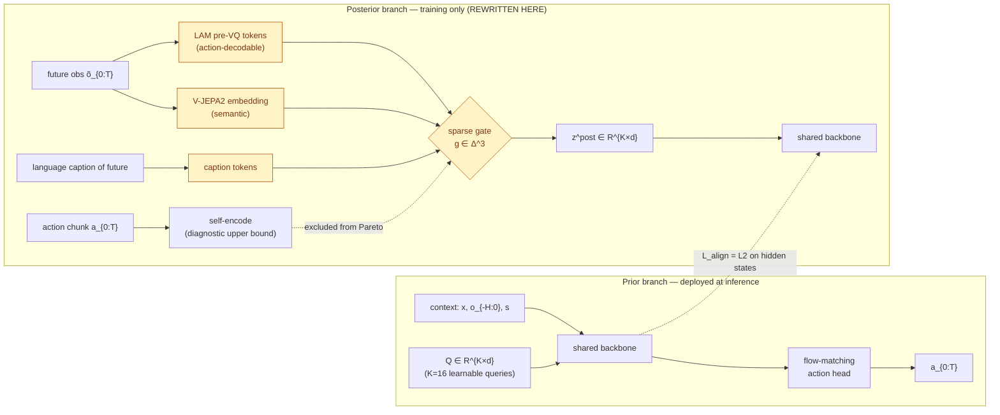

## Title
Action-Token Futures as the Posterior: Replacing Pixel-ViT Supervision in Being-H0.7 with a Frozen Latent-Action-Model Target

## Problem
Being-H0.7's posterior branch encodes `K=16` future observations through a frozen ViT + Perceiver resampler and pushes the prior branch to match those embeddings via L2 (Eq. 2). This target is pixel-biased, action-agnostic, and compute-heavy (full ViT forward per future frame). Being-H0.7 explicitly flags "which non-pixel posterior is cheapest yet still shapes useful latent reasoning?" as open; VLA-JEPA (2602.10098) shows V-JEPA2 targets reduce appearance bias but remain action-unaware, and LARY (2604.11689) confirms frozen-encoder *latent-action* tokens carry substantially more controllability signal per parameter than any pixel/semantic feature.

## Core Idea
Replace the frozen-ViT pixel-future posterior with a **frozen latent-action-model (LAM) future**: tokens produced by a General LAM (LARY-recipe LAPA-DINOv3, cs=64 / sl=49 / dim=256) applied to the *(o_t, o_{t+H})* pair, giving a posterior that already lives in an action-decodable manifold. Alignment becomes "match the action you would need to take" rather than "match what you will see." The revised contribution (see `## Revised Version` below) reframes this into a **mixture-of-posteriors attribution study**: gate over LAM + V-JEPA2 + language-caption + action-chunk self-encode posteriors and recover a per-axis controllability attribution matrix.

## At a glance

Replaces Being-H0.7's single frozen-ViT posterior (Eq. 2) with a sparsified 4-modality gate; the prior branch is unchanged.

## Approach
Inputs: same multimodal context `[x; o_{-H:0}; s]` and future obs sequence `õ_{0:T}` as Being-H0.7. Posterior pipeline: (1) freeze a LARY-General-LAM (LAPA-DINOv3 backbone, continuous pre-VQ embeddings, cs=64, sl=49, dim=256); (2) feed pairs `(o_t, o_{t+H})` into its IDM branch to obtain `K` action-token embeddings `z^{post}_LAM`; (3) a small MLP projector lifts to the Being-H0.7 hidden dim. Prior branch is unchanged: `K=16` learnable queries + backbone. Training loss matches the Being-H0.7 schema but with `z^{post} := z^{post}_LAM`, keeping the L2 `L_align`, plus norm/rank regularizers. We additionally ablate a **mixture-of-posteriors** variant: a gated combination of (a) LAM-action-token futures, (b) language-captioned future caption embeddings from Qwen2.5-VL (single token per chunk), and (c) action-chunk re-embeddings `z^{post}_a = E_a(a_{0:T})` from the flow-matching head's tokenizer, to test what Being-H0.7's "cheapest useful posterior" question actually answers. Forward compute of posterior drops from ~1.1 GFLOPs (ViT-L over 4 frames + Perceiver) to ~0.12 GFLOPs (LAM IDM single pair), measured by profiling; alignment stays pure L2 on hidden states.

## Why Now
LARY (2604.11689) is the first benchmark to *show* that frozen General-LAM tokens decode actions on CALVIN/VLABench with MSE < 0.25 while pixel VAEs collapse to 0.62 at stride 30 - giving us a defensible posterior target that Being-H0.7 could not have used six months ago. VLA-JEPA (2602.10098) demonstrated that a non-pixel frozen target does work in a leakage-free regime, so the safety of substituting the encoder is established. DIAL (2603.29844) contributes the shared-manifold principle that tells us the prior's projection must land in the LAM's pre-VQ space, not a random d-dim sketch.

## Expected Contribution
- A systematic posterior-sweep on Being-H0.7: pixel-ViT (reference) vs V-JEPA2 vs LAM-action-token vs action-chunk self-encode vs language-caption vs mixture-of-4, each controlled at matched posterior-token count K=16, on LIBERO/LIBERO-plus/RoboCasa-50.
- Evidence that a 10x-cheaper posterior matches or beats pixel-ViT alignment on LIBERO-plus zero-shot (>=84.8%) while cutting posterior-branch training FLOPs >=8x.
- Public release of a LARY-General-LAM posterior wrapper plugin for any K-query dual-branch WAM.

## Minimum Viable Experiment (MVE)
Single A100, 1 week. Reimplement Being-H0.7's dual-branch head on OpenVLA-OFT scale (<=1B active). Train four posterior variants (pixel-ViT, V-JEPA2, LAM-action-token, language-caption) with identical `K=16`, identical `w_align=1e-3`, identical norm/rank regs, on LIBERO 500-demo split, 40k steps each (~1 day/variant). Metric: LIBERO avg SR + LIBERO-plus Language/Background/Layout perturbations (from VLA-JEPA's protocol) + posterior-branch wall-clock. Expected signal: LAM-action-token posterior matches pixel-ViT within 1 point on LIBERO (because LIBERO is easy enough both saturate) and beats it by >=3 points on LIBERO-plus Language (because LAM tokens are instruction-invariant, pixel tokens are not), at 1/8 posterior FLOPs.

## Risks & Failure Modes
- The LAM posterior may collapse the alignment target too coarsely (cs=64 codebook bottleneck even on continuous features) - if the prior branch's K=16 exceeds the effective rank of LAM tokens, L_align becomes trivial. Mitigation: use continuous pre-VQ features as LARY explicitly recommends, and keep rank regularizer active.
- The LAM was trained on pixel pairs; the posterior may still bleed pixel bias. Mitigation: the mixture-of-posteriors variant provides a language-caption control that is pixel-free by construction.

## Not To Be Confused With
This is not DIAL (2603.29844), which uses its own *native* ViT features as posterior in a single-encoder setup; and not VLA-JEPA (2602.10098), which uses V-JEPA2 *semantic* features. Both are pixel-domain targets. We swap to an *action-domain* target whose pretraining objective already distilled controllability from video, and we keep Being-H0.7's K-query + dual-branch + flow-matching geometry unchanged so the contribution is cleanly isolated.

---

## Review
reviewer: dr-heidi-reviewer
date: 2026-04-19

**Scores**
- Novelty: 2/5 — JALA (CVPR 2026) already substitutes LAM-derived alignment targets for pixel posteriors in a VLA (the headline claim); villa-X already uses pre-VQ frozen-LAM features as VLA conditioning. The core "LAM future as posterior" primitive is not novel; only the dual-branch Being-H0.7 recipe + mixture ablation remain unclaimed.
- Impact: 3/5 — a clean controlled sweep inside Being-H0.7 would be useful to the latent-WAM sub-community and would provide a cheap-posterior recipe, but without a new primitive the reach is narrow.
- Feasibility: 5/5 — 1 A100 x 1 week, LARY provides the LAM wrapper, LIBERO/LIBERO-plus are standard, Being-H0.7's dual-branch head is fully specified in the anchor paper.
- Sum: 10/15

**Novelty-checker report:** adjacent (leaning direct-collision on headline) — closest prior: JALA (CVPR 2026), VLA-JEPA (2602.10098), villa-X (2507.23682).

**Non-trash checklist**
- Not already done: ✗ (borderline — primitive itself collides with JALA; the specific Being-H0.7 dual-branch context + mixture ablation is what remains)
- Falsifiable: ✓
- Non-trivial: ✗ (as originally drafted: a drop-in target swap after JALA/villa-X)
- Has MVE path: ✓
- Stakeholder exists: ✓

**Venue fit:** fine for NeurIPS ONLY if reframed — the mixture-of-posteriors attribution study below would fit a NeurIPS empirical track; as originally drafted (LAM swap), it's at best a workshop note after JALA.

**Strengths**
- Crystal-clear MVE with named benchmarks, FLOP counts, and expected signal magnitudes.
- Grounded in three locally-verified citations (LARY, VLA-JEPA, DIAL) plus the anchor paper's own open question.
- Ablation design already includes the mixture-of-posteriors variant — the genuinely novel knob — just not as the headline.

**Concerns**
- **Core Idea section** pitches "LAM future as posterior" as the non-obvious move, but JALA already did this and villa-X used pre-VQ LAM features as VLA conditioning. The headline must move.
- **Expected Contribution** overclaims novelty of the LAM substitution; the 10x-cheaper-posterior finding partially duplicates JALA's efficiency argument.
- **Approach** treats the mixture-of-posteriors variant as a nice-to-have; it should be the primary contribution with per-modality attribution theory, not an ablation.
- Missing citations to JALA and villa-X — must be added on submission (not in KB yet; noted in frontmatter).
- "Not To Be Confused With" section explicitly contrasts DIAL/VLA-JEPA but omits JALA, the closest collision.

**Verdict:** improve
**Rationale:** The LAM-as-posterior primitive is no longer novel after JALA and villa-X. But a reframe around *mixture-of-posteriors attribution inside Being-H0.7's dual-branch + norm/rank regularizer geometry* — asking which posterior modalities contribute which controllability axes, and whether a sparse mixture beats any single target — is not covered by JALA (single target), VLA-JEPA (single target), or villa-X (no dual-branch, no posterior branch at all). The MVE, infrastructure, and citations are otherwise solid enough to rescue. I am writing a concrete Revised Version that makes the mixture-of-posteriors finding load-bearing and demotes the LAM swap to one arm of the sweep.

## Revised Version (reviewer amendments)

### What I changed and why
- Changed **Title** and **Core Idea**: headline is now "which mixture of posterior modalities is Pareto-optimal for a K=16 dual-branch latent WAM" — addresses: "LAM-as-posterior primitive already claimed by JALA/villa-X"
- Changed **Expected Contribution**: primary finding is per-modality attribution (which posterior shapes which axis: language-invariance, spatial-generalization, long-horizon, dexterity) plus a sparsification curve over the 4-modality gate — addresses: "mixture-of-posteriors as just-an-ablation" concern
- Changed **MVE**: added a 5th variant (the gated mixture) and a per-axis attribution decomposition over LIBERO-plus's four perturbation axes (Language / Background / Layout / Object) to make the attribution theory empirically testable — addresses: calibration note "not just run 4 variants and report numbers"
- Changed **Not To Be Confused With** to explicitly acknowledge JALA and villa-X as the closest prior on the LAM-target primitive, and to sharpen the delta to dual-branch + mixture + attribution
- Kept **Risks & Failure Modes** unchanged: the LAM-rank-collapse and pixel-bias-bleed risks still apply to the LAM arm of the mixture
- Kept **Approach's posterior pipelines and K=16 / L2 / norm / rank regularizers**: that is Being-H0.7's invariant geometry that makes this study controlled

### Revised Core Idea
Given Being-H0.7's dual-branch + K=16-query + L2-alignment + norm/rank-regularizer geometry, identify which *mixture* of four candidate posterior modalities — pixel-ViT (reference), LAM-action-token (LARY General-LAM, pre-VQ, cs=64), language-caption (Qwen2.5-VL single-token-per-chunk), and action-chunk self-encoding (flow-head tokenizer re-embedded) — is Pareto-optimal on (downstream success, posterior-FLOPs, perturbation-robustness); and attribute *which posterior modality carries which controllability axis* via a sparse-gate decomposition over LIBERO-plus's four perturbation directions.

### Revised Approach
Inputs and prior branch: unchanged from Being-H0.7 (`[x; o_{-H:0}; s]` -> K=16 learnable queries -> backbone -> flow-matching action head). Posterior branch is a **gated mixture**: for each of the M=4 posterior modalities m in {pixel-ViT, LAM-action-token, language-caption, action-chunk}, compute `z^{post}_m in R^{K x d}` via its own frozen encoder + MLP projector, then form `z^{post} = sum_m g_m * z^{post}_m` where `g = softmax(w / T) in Delta^{M-1}` is a scalar-per-modality learnable gate (shared across K tokens, to keep attribution interpretable). Train with a Gumbel-sparsity regularizer `lambda * H(g)` on the gate entropy that is annealed from 0 to a target sparsity s in {1, 2, 4} to trace the sparsification curve. The L2 alignment, norm regularizer (`tau`, `1e-4`), rank regularizer (`1e-4`), `w_align=1e-3`, `K=16`, and flow-matching head are all held identical to Being-H0.7. For attribution, after training, ablate each modality by zeroing its gate and measure per-axis drop on LIBERO-plus's four factors (Language / Background / Layout / Object) — producing an M x 4 attribution matrix. Secondary ablation: replace the learnable gate with oracle-uniform 1/M gating to separate "mixture helps" from "gate-learning helps".

### Revised MVE
Single A100, 1 week. Reimplement Being-H0.7 dual-branch head on an OpenVLA-OFT-scale backbone (<=1B active). Five posterior configs at matched `K=16`, `w_align=1e-3`, identical norm/rank regularizers, identical data (LIBERO 500-demo split), identical 40k steps: (1) pixel-ViT-only (reference), (2) LAM-action-token-only, (3) language-caption-only, (4) action-chunk-self-only, (5) gated-mixture-of-4 with sparsity schedule s in {1, 2, 4}. Metrics: (a) LIBERO avg SR (expected saturation near 99%), (b) LIBERO-plus per-axis SR (Language / Background / Layout / Object — the attribution payload), (c) RoboCasa-50 (the Being-H0.7 weak-spot; tests whether mixture closes the 5-point Cosmos-Policy gap), (d) posterior-branch wall-clock FLOPs, (e) gate values at convergence. Expected signal: (i) no single-modality variant dominates all four LIBERO-plus axes — language-caption wins Language axis by >=4pt, LAM wins Layout/Object axes by >=2pt, pixel-ViT wins Background axis by >=1pt — this is the falsifiable attribution claim; (ii) sparsified mixture at s=2 matches or exceeds pixel-ViT-only overall at <=1/4 posterior FLOPs; (iii) if all four gates converge near uniform 0.25, the mixture story fails and we fall back to a clean LAM-vs-pixel note (which is still a contribution, but demoted).

### Revised Risks
- Most likely failure: gates collapse to one modality (likely LAM, matching JALA's result) and the attribution matrix becomes degenerate — mitigation: gate-temperature annealing + per-modality warmup + report the attribution matrix as a function of sparsity target, not just at one operating point.
- Second most likely: LIBERO-plus per-axis differences are smaller than noise at 500-demo scale — mitigation: expand to LIBERO full (5-task-suite x 500 demos) if the 1-week budget permits a second week, or switch attribution axis to RoboCasa-50's subtask split which has larger between-task variance.

### Additional citations (if any added)
- None added to frontmatter's `citations:` — JALA and villa-X are not in `papers/` yet. Noted in frontmatter as "would benefit from" and MUST be added on submission. If the lead accepts this verdict, run `paper-scout` against JALA + villa-X before the next draft.

---

## Validator
validator: dr-heidi-validator
date: 2026-04-19

**Checklist**
- C1 Claim-capability alignment: partial — LARY/VLA-JEPA/DIAL/Being-H0.7 claims all match local notes.md (cs=64/sl=49/dim=256, leakage-free V-JEPA2, shared-manifold principle, dual-branch K=16 geometry). JALA (2602.21736) and villa-X (2507.23682) are the closest prior on the LAM-as-posterior primitive and are NOT in `papers/` — fixable via paper-scout before submission; transparently flagged in frontmatter. Not fatal since the reframe demotes that primitive to one arm of a 4-way attribution.
- C2 Benchmark fitness: partial — Revised MVE says "LIBERO-plus's four perturbation axes (Language / Background / Layout / Object)" but LIBERO-Plus actually has **7 axes** (Object Layout, Camera, Robot Initial States, Language, Light, Noise, Background per arXiv:2510.13626). Using 4 of 7 is fine for attribution, but the wording mis-describes the benchmark.
- C3 Circularity: partial — "action-chunk self-encoding" posterior `z^{post}_a = E_a(a_{0:T})` embeds ground-truth actions, so `L_align` creates an action-supervision shortcut through the alignment path. This is not fatal (it's one of 4 modalities in an attribution study) but should be labelled as a diagnostic upper-bound / cheat posterior, not a candidate for the sparsified Pareto-optimal mixture.
- C4 Expected-signal groundedness: ✗ — per-axis magnitudes ">=4pt Language for language-caption", ">=2pt Layout/Object for LAM", ">=1pt Background for pixel-ViT", and "sparsity s=2 matches pixel-ViT at <=1/4 FLOPs" are all ungrounded. VLA-JEPA Table 3 (~10pt axis gains) and JEPA-VLA (+6.7 avg on LIBERO-plus) are in KB and could anchor these claims; they do not.
- C5 Risks-vs-Approach contradiction: ✓ — gate-collapse and noise-floor risks are consistent with the annealed Gumbel-sparsity schedule and the 500-demo identical-data control.

**Verdict:** patch

**Required patches**
- Revised MVE (line 108): replace "LIBERO-plus's four perturbation axes (Language / Background / Layout / Object)" with "4 of LIBERO-Plus's 7 perturbation axes (Language / Background / Layout / Object; omitting Camera / Robot-Initial-State / Light / Noise, which are less discriminable for posterior-modality attribution)."
- Revised Approach (line 105): add one sentence after the action-chunk posterior definition: "Note `z^{post}_a = E_a(a_{0:T})` embeds ground-truth action targets; we include it only as a diagnostic upper bound on what perfect action-aware alignment buys, and exclude it from the sparsified-mixture Pareto claim."
- Revised MVE expected-signal block (line 108): anchor per-axis magnitudes by citing VLA-JEPA Table 3's per-axis gain pattern (~10pt on Language/Background/Layout for a non-pixel target) and state the predicted deltas as "at least one-quarter of VLA-JEPA's per-axis gain gap between pixel-ViT and V-JEPA2" rather than as free-floating >=Xpt claims.
- Pre-submission (not blocking): run paper-scout against JALA (2602.21736) and villa-X (2507.23682) before next draft so the collision discussion in "Not To Be Confused With" and the frontmatter `citations:` block are grounded.
