## Title
Mixture-of-Queries: Instruction- and Embodiment-Dispatched Latent Queries for Cross-Skill Generalization in Dual-Branch WAMs

## Problem
Being-H0.7's `K=16` latent queries are static learnable parameters that every task, embodiment, and instruction shares - a single Q pool must absorb pick-and-place, articulated manipulation, dexterous dual-arm, and humanoid locomotion. The paper openly flags cross-embodiment transfer as an open axis. HCLSM (2603.29090) has a similar pathology: 32 flat slots with no routing, and its authors list hierarchical / task-dispatched query structure as the primary next step. Existing cross-embodiment VLAs (pi0.5, GR00T) push embodiment conditioning into the *action head*, not into the reasoning substrate, so latent capacity is wasted on disambiguation instead of planning.

## Core Idea
Replace Being-H0.7's flat `Q \in R^{16 x d}` with a **Mixture-of-Queries (MoQ)**: a bank of `E=8` *expert query pools* each of size `K_e=16`, plus a *token-level* router `r(x_inst, e_id) -> softmax over E` conditioned on the instruction embedding and a one-hot embodiment id; at each layer the prior branch attends only through the top-2 expert pools chosen per instruction, giving task-dispatched latent reasoning with fixed active-parameter budget.

## At a glance

```mermaid
flowchart LR
    Inst["instruction CLS token"] --> Router["router r_θ"]
    Emb["embodiment id<br/>(one-hot → learnable emb.)"] --> Router
    Router --> Top2["top-2 gumbel softmax"]

    subgraph Bank["expert query bank — E=8 pools × K_e=16 queries"]
        E1["Q^{(1)} ∈ R^{16×d}"]
        E2["Q^{(2)}"]
        E3["Q^{(3)}"]
        Edots["..."]
        E8["Q^{(8)}"]
    end
    Bank --> Top2
    Top2 --> Qact["Q_active ∈ R^{32×d}<br/>(concat of 2 selected pools)"]

    Ctx["context: x, o_{-H:0}, s"] --> Bkb["prior-branch backbone"]
    Qact --> Bkb
    Bkb --> Head["flow-matching action head"]
    Head --> Act["a_{0:T}"]

    Bkb -. "per-expert L_align<br/>(norm + rank reg per active pool)" .- Post["posterior-mirrored encoder<br/>(same routing)"]

    Router -. "L_balance (Switch-style)" .-> Bank

    classDef new fill:#dbeafe,stroke:#1d4ed8,color:#1e3a8a;
    class Router,Top2,Bank,Qact new;
```

At 5-shot eval on a held-out embodiment: experts are **frozen**; only the new embodiment embedding is trained (~5 demos), testing whether skill composition emerges as a convex combination of expert pools.

## Approach
Architecture: keep Being-H0.7's prior/posterior/MoT pack. Replace the single learnable `Q \in R^{16 x d}` with `Q \in R^{E x K_e x d}`, E=8 experts, K_e=16. A router head `r_\theta(e_inst, e_embod)` takes the pooled instruction CLS token from the VLM encoder and a learned embodiment embedding (one per of {Franka, GR1, Unitree-G1, ALOHA-bimanual, PND-AdamU, human-hand, ...}); outputs E softmax weights, top-2 kept with straight-through gumbel. Selected expert pools are concatenated (yielding 32 active queries) and participate in transformer propagation. Load-balancing auxiliary loss `L_balance = E * sum_e (f_e * p_e)` (Switch-Transformer-style) with weight 0.01 to prevent expert collapse. Posterior branch: a symmetric MoQ - the posterior encoder produces `E x K_e` future embeddings and routes with the *same* router outputs, keeping L_align in the same per-expert space. Inference uses argmax routing (deterministic). Critically, at test time on an *unseen* embodiment we freeze the expert pools and train only the one-hot embodiment embedding with 5 demos, testing whether skill composition emerges as a convex combination of expert pools. Ablations: flat K=32 (matches active param count), MoQ without router (uniform weights), MoQ without embodiment id (instruction-only).

## Why Now
HWM (2604.03208) validated that a 4-dim latent macro-action encoder transferable across Franka tasks carries enough abstract intent to drive hierarchical MPC - a strong existence proof that low-dim task-dispatched latents are useful. HCLSM (2603.29090) and Being-H0.7 simultaneously converged on K=16-32 flat slots despite different pretraining regimes, which is evidence that flat-Q is the current structural ceiling. LARY (2604.11689) gives the first principled sizing recipe (cs=64 codebook size, sl=49 sequence length) from ablation - our E=8 + K_e=16 is a direct downstream read of that curve. MoE routing itself is old, but its use as a *reasoning-substrate router* (not an FFN router) for dual-branch WAMs is not present in any of the 22 KB papers.

## Expected Contribution
- First study of query-space expert routing in a dual-branch WAM; isolates whether Q's *parameterization* matters by matching active params to flat-K=32 baseline.
- On RoboCasa-50 (where Being-H0.7 loses to Cosmos-Policy 62.1 vs 67.1), predict +3-5 absolute points by letting kitchen-specific expert pools specialize without interference from LIBERO-style pick-and-place experts.
- Cross-embodiment 5-shot protocol (freeze experts, train only embodiment token) demonstrating whether MoQ composes better than flat-Q.

## Minimum Viable Experiment (MVE)
Single A100, 1 week. Reimplement Being-H0.7 prior branch on OpenVLA-OFT-1B backbone, load Being-H0.5 egocentric-video pretraining if available or skip and go directly to LIBERO+LIBERO-plus+RoboCasa-50 joint fine-tune (80k steps, ~4 days). Two arms: (A) flat K=32, (B) MoQ E=8 x K_e=16 top-2 with embodiment ids drawn from {LIBERO-Franka, RoboCasa-Kitchen, LIBERO-plus-Franka}. Metric: LIBERO avg, RoboCasa-50 avg, RoboCasa-50 held-out-5-task (freeze experts, tune only a new embodiment token for 5k steps on 5 new kitchen tasks). Expected signal: MoQ matches flat-K on in-distribution LIBERO (because LIBERO saturates), beats flat-K by >=3 points on RoboCasa-50 (because expert pools absorb kitchen priors), and beats flat-K by >=5 points on held-out-5-task (because composing experts via a single new embodiment token is easier than reshaping 32 flat queries with 5 demos).

## Risks & Failure Modes
- Router collapse to a single expert: the load-balancing loss may be insufficient when one embodiment dominates the data mix. Mitigation: per-embodiment-batch balanced sampling and a higher balance weight (0.05) as fallback.
- Posterior-side routing may conflict with the norm/rank regularizers (which assume a single Gram matrix over K queries). Mitigation: compute regularizers per active expert pool, not over the union.
- The gain might come purely from 2x active query budget (32 vs 16), not from routing. Mitigation: the flat-K=32 baseline is the critical control; if MoQ does not beat it, the idea fails.

## Not To Be Confused With
This is not the Mixture-of-Transformers pack from Being-H0.7 or Fast-WAM (2603.16666) - those route *layers*, not *queries*. It is not DIAL's (2603.29844) instruction-conditioned learnable tokens, which scale with N = number of ViT patches and are not expert-routed. And it is not HWM (2604.03208), which operates on macro-actions at inference only with no expert bank. MoQ is specifically a *parameter-level routing* over the reasoning-substrate queries themselves.

This is also distinct from three external priors flagged by the novelty-checker. **X-VLA (2510.10274, ICLR 2026)** uses *indexed* per-embodiment soft prompts — a table lookup keyed by data source — with no learned gate, no load balancing, and no multiple expert pools; MoQ's delta is (i) a learned token-level router conditioned on *instruction embedding x embodiment id* (not just embodiment), (ii) Switch-style load-balancing that lets a single embodiment compose multiple expert pools, and (iii) a posterior-mirrored router so alignment is computed per-expert rather than on a flat Gram matrix. **MoIRA (2507.01843)** routes whole LoRA adapters at the specialist level from instruction text; MoQ routes at parameter-level over Perceiver-style reasoning-substrate queries, which is a finer granularity (32 active queries vs. full adapter swap) and lives inside the dual-branch WAM rather than on top of frozen VLA specialists. **Cui et al. (2409.12011)** established MoE-over-soft-prompts for CLIP classification without embodiment conditioning, load-balancing, or posterior mirroring; MoQ inherits the top-K routing primitive and extends it to embodied dual-branch training.

---

## Review
reviewer: dr-heidi-reviewer
date: 2026-04-19

**Scores**
- Novelty: 3/5 — novelty-checker flags adjacent; X-VLA (2510.10274) already covers "freeze-and-train-new-prompt" cross-embodiment adaptation, and MoIRA covers routed VLA specialists, so the load-bearing delta reduces to "learned token-level MoQ + load balancing + posterior mirror over reasoning-substrate queries" — novel as a combination but not as a primitive.
- Impact: 3/5 — if the +3-5 RoboCasa-50 gain lands with a mechanistic explanation (not just asserted), the WAM/latent-planning subcommunity cites; if not, it reads as an engineering note on top of X-VLA.
- Feasibility: 4/5 — single A100, 1 week, concrete E=8/K_e=16, flat-K=32 control is the right ablation; main risk is Being-H0.7 reimplementation friction on top of OpenVLA-OFT-1B.
- Sum: 10/15

**Novelty-checker report:** adjacent — X-VLA (2510.10274), MoIRA (2507.01843), Cui et al. (2409.12011). Each covers one face of the cube; specific MoQ construction with posterior mirror is still novel.

**Non-trash checklist**
- Not already done: ✓ (adjacent, not direct-collision)
- Falsifiable: ✓ (flat-K=32 control + held-out-5-task 5-shot are pre-registered fail conditions)
- Non-trivial: ✓ (token-level MoE over reasoning-substrate queries with posterior-mirrored alignment is a non-obvious mechanism, not A+B)
- Has MVE path: ✓ (LIBERO + RoboCasa-50 + held-out-5-task; Being-H0.7 + OpenVLA-OFT-1B backbone; all datasets and baselines nameable from cited papers)
- Stakeholder exists: ✓ (Being-H0.7 / HCLSM / dual-branch WAM authors who explicitly flag "instruction-conditional / task-dispatched Q" as the next axis)

**Venue fit:** fine for NeurIPS if the X-VLA delta is experimentally demonstrated (MoQ vs. X-VLA-style indexed prompt on matched active params); mismatched for CoRL unless real-robot results are added.

**Strengths**
- The **flat-K=32 control** is the correct critical control and the draft names it explicitly — this is rare and well-disciplined.
- The **held-out-5-task protocol** (freeze experts, train only a new embodiment token with 5 demos) is a sharp falsifiability test for the compositional claim and is directly comparable to X-VLA's own 5-shot evaluation.
- Grounding on **LARY's cs=64 curve** for E=8 expert count is a principled sizing choice rather than a hand-picked hyperparameter.

**Concerns**
- The **Approach** section did not contrast against X-VLA's indexed-prompt recipe, which is the single closest prior and the one most likely to be raised by reviewers; the novelty-checker explicitly required this. I've added a "Not To Be Confused With" paragraph that names X-VLA, MoIRA, and Cui et al., but the draft needs an **X-VLA-style indexed-prompt baseline in the MVE** to be defensible.
- The **+3-5 point RoboCasa-50 gain** in Expected Contribution is asserted, not motivated mechanistically. The novelty-checker's calibration note is correct: the posterior mirror needs to solve a *specific* failure mode X-VLA's flat indexed prompt cannot — I name "skill composition across multiple kitchen sub-skills per embodiment" as that mechanism below.
- Posterior-side regularizer conflict (flagged in Risks) is understated — computing R_norm and R_rank per expert pool changes the effective rank target and should be derived, not just "fall back to per-expert."
- The **5-shot protocol** overlaps substantially with X-VLA's existing recipe; the delta is "compose multiple frozen expert pools via a single learned embodiment token" vs. X-VLA's "train one new prompt." This needs to be the headline experiment with X-VLA as a baseline, not flat-K=32.

**Verdict:** improve
**Rationale:** The MoQ construction is mechanistically non-trivial and the MVE is executable, but the draft leaves the X-VLA delta implicit — the single biggest risk to the paper's selling point. The Revised Version below sharpens the X-VLA contrast into a concrete baseline, motivates the RoboCasa gain via the skill-composition mechanism, and reframes the headline experiment around compositional cross-embodiment adaptation rather than in-distribution wins.

## Revised Version (reviewer amendments)

### What I changed and why
- Added **X-VLA-style indexed-prompt baseline** to the MVE: addresses "the X-VLA delta is the critical pressure point; flat-K=32 alone is not the right control for the 5-shot claim."
- Reframed **Core Idea** to foreground *multi-expert composition per embodiment* as the mechanism, not just "task-dispatched queries": addresses "the +3-5 gain needs mechanistic motivation."
- Made **held-out-5-task the headline experiment** with explicit success criterion (beat X-VLA indexed prompt by >=3 points at matched active-parameter budget): addresses "the 5-shot protocol's delta from X-VLA must be justified."
- Added **per-expert posterior regularizer derivation** to Risks: addresses "R_norm / R_rank per-expert is not a trivial fallback."
- Kept **flat-K=32 ablation, E=8/K_e=16 sizing, LARY grounding, router architecture** unchanged: these are well-motivated and survive the critique.

### Revised Core Idea
Replace Being-H0.7's flat `Q \in R^{K=16 x d}` with a **Mixture-of-Queries (MoQ)** — a bank of `E=8` expert query pools of size `K_e=16`, routed token-level by a learned gate conditioned on `(instruction embedding, embodiment id)` with top-2 selection and Switch-style load balancing — so that *each embodiment composes multiple expert pools* (not just indexes one), with a posterior-mirrored router keeping L_align computed per-expert; this is the mechanism by which a single 5-shot-tuned embodiment token can unlock skill composition that X-VLA's indexed per-embodiment soft prompt provably cannot.

### Revised Approach
Keep Being-H0.7's prior/posterior/MoT pack. Replace `Q \in R^{16 x d}` with `Q \in R^{E x K_e x d}`, E=8, K_e=16. Router `r_\theta(e_inst, e_embod) -> softmax over E` takes pooled instruction CLS + learned embodiment embedding; top-2 kept via straight-through gumbel, yielding 32 active queries. Load balancing `L_balance = E * sum_e (f_e * p_e)` with weight 0.01. **Posterior mirror:** the posterior encoder produces `E x K_e` future embeddings; the same router weights are reused so `L_align` is computed per-expert (`L_align = sum_{e in top-2} w_e * L_align_e`) rather than on the union — this is the component that X-VLA, MoIRA, and Cui et al. all lack. Per-expert norm/rank regularizers: `R_norm` and `R_rank` are computed on each active expert's Gram matrix separately and averaged, so the effective rank target scales with K_e=16 (not union-32), preserving Being-H0.7's original regularizer semantics. At test time on an unseen embodiment: freeze all expert pools, freeze the backbone, train **only the one-hot embodiment embedding** with 5 demos for 5k steps. The router then learns a *mixture* over frozen experts for the new embodiment, which is the compositional capacity X-VLA's single-indexed-prompt recipe cannot express.

### Revised MVE
Single A100, 1 week. Reimplement Being-H0.7 prior branch on OpenVLA-OFT-1B backbone; skip egocentric pretraining, joint fine-tune on LIBERO + LIBERO-plus + RoboCasa-50 for 80k steps. **Four arms at matched active-parameter budget (32 queries):** (A) flat K=32 baseline, (B) X-VLA-style indexed-prompt baseline — E=8 pools of K_e=32 each but *indexed* by embodiment id with no gate or load balancing (our reimplementation of X-VLA's recipe adapted to dual-branch), (C) MoQ without posterior mirror (router only on prior branch; L_align on flat union), (D) MoQ full (router + load balance + posterior mirror). **Metrics:** LIBERO avg, RoboCasa-50 avg, RoboCasa-50 held-out-5-task 5-shot (train only new embodiment token for 5k steps). **Headline signal:** (D) - (B) >= +3 absolute points on held-out-5-task. **Secondary signals:** (D) matches (A/B) on LIBERO (saturation), (D) >= (A/B) + 3 on RoboCasa-50 avg, (D) - (C) >= +1 on held-out-5-task (ablating the posterior mirror). If (D) does not beat (B) on held-out-5-task, the paper's selling point fails and the idea reduces to an engineering note.

### Revised Risks
- **Most likely failure:** (D) matches (B) on held-out-5-task because X-VLA's indexed prompt is already expressive enough at K_e=32 — posterior mirror helps during training but routing adds no inference-time compositional capacity. This is the X-VLA-delta-is-marginal failure and would be publishable only as a negative result.
- **Second most likely:** Posterior-mirrored L_align destabilizes training because per-expert Gram matrices are rank-deficient at K_e=16 under sparse top-2 activation; the rank regularizer pushes toward uniform eigenspectrum inside expert pools that are actively specializing, producing an objective conflict. Mitigation: anneal `w_rank` per-expert by `(1 - active_fraction_e)` so under-used experts are not over-regularized.
- Router collapse and conflict with Being-H0.7's norm regularizer: already flagged in original Risks; mitigations (per-embodiment balanced sampling, per-expert regularizer computation) remain valid.

### Additional citations (if any added)
- 2510.10274 (X-VLA), role: prior-art-contrast, note: closest prior on per-embodiment soft prompts; primary baseline (B) in the MVE. **Not in local papers/** — flagged by novelty-checker via WebSearch. Would benefit from: fetching X-VLA into the local KB via paper-scout before implementation starts.
- 2507.01843 (MoIRA), role: prior-art-contrast, note: instruction-routed VLA adapter MoE at coarser granularity; cited for positioning, not as a baseline. **Not in local papers/**. Would benefit from: fetching into local KB.
- 2409.12011 (Cui et al.), role: prior-art-lineage, note: MoE-over-soft-prompts for CLIP; cited to acknowledge lineage of the primitive. **Not in local papers/**. Would benefit from: fetching into local KB.

---

## Validator
validator: dr-heidi-validator
date: 2026-04-19

**Checklist**
- C1 Claim-capability alignment: ✓ — Being-H0.7 notes confirm K=16 static queries, RoboCasa-50 62.1 vs Cosmos-Policy 67.1, and explicit open-question "mixture-of-queries with a router". LARY's cs=64 is a VQ codebook size (not an MoE expert count); the idea's "direct downstream read" framing is an analogy-stretch but frontmatter is honest about the reuse. X-VLA/MoIRA/Cui are external but explicitly marked as not-in-KB; 4 local citations satisfy the ≥3 grounding rule.
- C2 Benchmark fitness: ✗ — The Revised Approach lists embodiments {Franka, GR1, Unitree-G1, ALOHA-bimanual, PND-AdamU, human-hand, ...} but the Revised MVE trains only on LIBERO-Franka + LIBERO-plus-Franka + RoboCasa-Kitchen, and the held-out-5-task is still within RoboCasa kitchen. The "compositional cross-embodiment" headline is therefore tested across skill/scene distributions, not across morphologically distinct embodiments — a weaker claim than the Approach implies.
- C3 Circularity: ✓ — MVE Arm B (X-VLA-style indexed prompt) is an independent architectural baseline, not a self-comparison; posterior-mirror L_align uses future embeddings as targets, not MoQ's own outputs.
- C4 Expected-signal groundedness: ✓ (borderline) — the +3 on held-out-5-task is anchored loosely in Being-H0.7's 5-point gap to Cosmos-Policy on RoboCasa-50 (62.1 vs 67.1), giving a plausible ceiling. Not derived formally but not fabricated; the explicit "else reduce to engineering note" fallback is pre-registered.
- C5 Risks-vs-Approach contradiction: ✓ — Load-balancing is a training-phase auxiliary; freeze-experts-at-test-time is the 5-shot eval protocol. Different phases, no contradiction. Per-expert regularizer mitigation (w_rank annealing by (1 - active_fraction_e)) is internally consistent with the rank-deficiency risk it addresses.

**Verdict:** patch

**Required patches**
- Revised MVE: state explicitly that the MVE's "cross-embodiment" test is actually *cross-scene within Franka-family + mobile-kitchen*, not cross-morphology; either (i) narrow the headline claim to "cross-skill/scene compositional 5-shot" or (ii) add a single morphologically distinct held-out arm (e.g., GR1 or ALOHA 5-shot on a LIBERO/RoboCasa-equivalent task) as a stretch target. This resolves the Approach-vs-MVE embodiment-set mismatch.
- Revised Expected Contribution (bullet 2): add one sentence grounding the "+3-5 absolute points" in Being-H0.7's own 62.1-vs-67.1 gap so the magnitude reads as "reclaim a fraction of the Cosmos-Policy kitchen gap" rather than asserted.
