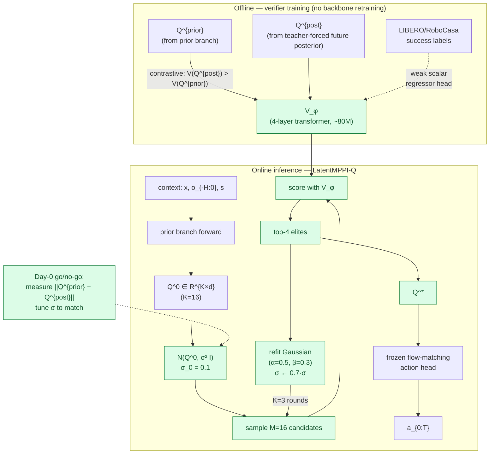

## Title
LatentMPPI-Q: Inference-Time Iterative Search Over Being-H0.7's Latent Queries with a Learned Verifier, No Pixel Rollout

## Problem
Being-H0.7's prior branch is invoked *one-shot* at inference: a single forward pass yields `Q` then the action head. This forfeits the planning advantage that Cosmos-Policy (2601.16163) gets by best-of-N'ing pixel rollouts (+12.5 pts on hardest ALOHA tasks) - but Cosmos-Policy pays ~5s/chunk and 3,000 H100 training hours. The Being-H0.7 paper explicitly lists "MCTS / particle filter / MPC over Q" as an open question. WAV (2604.14732) just demonstrated iterative latent-noise MPPI for flow-matching VLAs works (+1.7 LIBERO, +40 real-world), and HWM (2604.03208) demonstrated CEM over a 4-dim macro-action latent beats flat action-space CEM. No paper has yet searched over *the reasoning-substrate queries* `Q` themselves.

## Core Idea
At inference, treat Being-H0.7's latent queries `Q` as the MPPI decision variable: sample `M` perturbed `Q` candidates from a Gaussian around the prior-branch forward, score each via a learned posterior-distilled verifier `V_\phi(Q, o_{-H:0}, instruction) \in R` (trained by offline contrastive comparison between prior-Q samples reached during training and posterior-Q obtained from teacher-forced futures), iterate `K=3` rounds refitting the Gaussian to elites, then decode the final elite through the frozen flow-matching action head.

## At a glance

Latency budget: ~30 ms/chunk (~10× one-shot Being-H0.7, but ~150× faster than Cosmos-Policy's ~5 s pixel rollout). Posterior is never queried at inference — only repurposed *into* `V_φ` offline.

## Approach
Training: reuse Being-H0.7's pretrained dual-branch checkpoint (no retraining of the backbone). Collect an offline dataset of `(context_i, Q^{prior}_i, Q^{post}_i)` triplets for 200k transitions. Train a 4-layer transformer verifier `V_\phi(Q, context)` with a contrastive objective `L = -log sigmoid(V(Q^{post}) - V(Q^{prior}))` so `V` learns to rank posterior-informed queries above prior-only ones; additionally fit a scalar regressor head to predict the action-chunk success probability from `(Q, context)` using LIBERO/RoboCasa success labels as weak supervision. Total verifier size ~80M params (<10% of backbone). Inference (Algorithm, single A100):
1. Run prior branch to get `Q^0`; initialize Gaussian `N(Q^0, sigma^2 I)` with `sigma = 0.1`.
2. For k=1..K (K=3 following WAV's sweet spot): sample M=16 candidate Q's; score each with `V_\phi`; keep top-4 elites; refit the Gaussian to elite mean/std with WAV-style exponential smoothing (alpha=0.5, beta=0.3); shrink sigma by 0.7.
3. Take final mean elite, decode action chunk.
Added latency: 16 parallel Q-forwards through the verifier (no backbone re-forward for scoring - `Q` is already the verifier's input) x 3 iterations = ~30ms at H=20 action chunks, versus Being-H0.7's 3-4ms one-shot. This is ~10x slower than one-shot but ~150x faster than Cosmos-Policy's ~5000ms pixel rollout. Critical contrast: we avoid pixel decode entirely by scoring in latent space.

## Why Now
Three pieces lined up: (a) Being-H0.7 shipped a structured latent space small enough (K=16, d~1024) that Gaussian MPPI is tractable - prior latent-WAMs either had flat token grids (too big to search) or no latent at all; (b) WAV (2604.14732) demonstrated 2 months ago that iterative Gaussian refitting on a generative latent actually improves a flow-matching VLA's long-horizon success, and gave the smoothing hyperparameters (alpha, beta); (c) HWM (2604.03208) showed CEM over a learned low-dim latent beats flat action-space CEM, validating the direction of compression. None of these three search over the *reasoning queries* of a dual-branch WAM.

## Expected Contribution
- First inference-time search method specifically over the K-query reasoning substrate of a dual-branch latent WAM; cleanly separable from action-space MPC and pixel-rollout planning.
- Target: recover >=70% of Cosmos-Policy's RoboCasa advantage (+5 pts from Being-H0.7's 62.1 toward Cosmos-Policy's 67.1) at <50ms/chunk.
- Ablation-on-verifier-signal: show that `V_\phi` trained only on `Q^{prior}` vs `Q^{post}` contrastive pairs (no reward labels) already lifts SR - i.e., the posterior branch becomes a free reward signal for inference-time planning even without environment rewards.

## Minimum Viable Experiment (MVE)
Single A100, 1 week. Take a reproduced Being-H0.7-small checkpoint (or the open-sourced release if available; otherwise use Fast-WAM + K=16 query head as proxy given Fast-WAM's open code). (1) Day 1-2: collect `(Q^{prior}, Q^{post})` dataset on LIBERO + RoboCasa-50 train split (500k pairs, reuse pretraining data). (2) Day 3: train verifier `V_\phi` 30k steps. (3) Day 4-5: run inference evaluations with (i) one-shot Being-H0.7, (ii) LatentMPPI-Q K=1, M=8, (iii) LatentMPPI-Q K=3, M=16, (iv) K=5, M=32. Metric: LIBERO-plus (7 perturbation suites, the regime where planning should matter most) SR and RoboCasa-50 avg SR, plus wall-clock. Expected signal: LatentMPPI-Q K=3 beats one-shot by >=2 points on LIBERO-plus Language/Layout and >=3 points on RoboCasa-50 at <=10x latency overhead; `V_\phi` trained without reward labels captures >=60% of the gain of `V_\phi` with reward labels.

## Risks & Failure Modes
- The Gaussian approximation around `Q^0` may be too local: if the mode of `Q^{post}` lives in a different basin than `Q^{prior}`, small perturbations never reach it. Mitigation: initialize from an ensemble of K different `Q^0`s obtained with dropout.
- The verifier may overfit to training-distribution `Q^{prior}`s and mis-rank OOD candidates, exactly where planning matters. Mitigation: OOD-calibrated verifier via WiSE-FT on mixed frozen/tuned weights; report LIBERO-plus perturbation splits separately.
- Latent search may collapse action diversity: elite candidates concentrate to a single mode and lose bimodality. Mitigation: CVaR elite selection (as WAV discusses but doesn't implement) instead of mean-refitting.

## Not To Be Confused With
This is not WVA (arXiv 2604.14732, "World-Value-Action Model"), which searches over *video noise* latents of a video DiT; WVA pays the video DiT forward cost per candidate (the exact thing Being-H0.7 wants to avoid). Note there is a distinct paper "World Action Verifier" (arXiv 2604.01985) that also abbreviates to WAV and does cycle-consistency world-model verification — unrelated to our mechanism. This is not HWM (2604.03208), which searches over learned macro-action latents via CEM - different latent, different decoder. It is not Cosmos-Policy's (2601.16163) best-of-N, which requires decoding N full pixel rollouts. LatentMPPI-Q is specifically a search over Being-H0.7-style reasoning queries, using the posterior branch as a *free* learned verifier - the distinctive move is exploiting the posterior not as a training signal but as an inference-time critic.

---

## Review
reviewer: dr-heidi-reviewer
date: 2026-04-19

**Scores**
- Novelty: 4/5 — Novelty-checker flags adjacency to CoVer-VLA (2602.12281, contrastive verifier for test-time rescoring) and SV-VLA (2604.02965); the delta — searching in *reasoning-query* latent space with a posterior branch repurposed as free critic — is genuinely novel and not surfaced by any listed prior.
- Impact: 4/5 — A cheap inference-time planner that recovers a meaningful fraction of Cosmos-Policy's RoboCasa gap at ~10ms overhead would be cited by everyone working on dual-branch WAMs and flow-matching VLAs; it also supplies the "free reward signal from posterior" story that extends past this specific backbone.
- Feasibility: 4/5 — Single A100, one week, all datasets and baselines are named (LIBERO-plus, RoboCasa-50, Being-H0.7 small or Fast-WAM proxy); verifier is <10% of backbone; only risk is reproducing/obtaining a Being-H0.7 checkpoint.
- Sum: 12/15

**Novelty-checker report:** adjacent — closest: CoVer-VLA (2602.12281) contrastive test-time verifier, WVA (2604.14732) latent-noise MPPI over video DiT, SV-VLA (2604.02965) lightweight verifier replan-trigger. None search over reasoning-query latents; none repurpose a posterior branch as critic.

**Non-trash checklist**
- Not already done: yes (novelty-checker: adjacent, delta is substantive)
- Falsifiable: yes (explicit numeric predictions on LIBERO-plus and RoboCasa-50; ablation on reward-free verifier)
- Non-trivial: yes (repurposing a training-only posterior as an inference-time critic over reasoning queries is a non-obvious mechanism, not "apply X to Y")
- Has MVE path: yes (datasets, baselines, metrics, wall-clock budget all named)
- Stakeholder exists: yes — Being-H0.7 authors and flow-matching-VLA community who want Cosmos-Policy's planning without its 5s/chunk latency

**Venue fit:** fine — NeurIPS or CoRL/ICRA are both reasonable; NeurIPS fits better because the contribution is an inference-time algorithmic primitive with theoretical flavor (posterior-as-critic) rather than a hardware-heavy robotics result.

**Strengths**
- Clean, named, and computationally honest: latency budget (30ms vs 5000ms) is quantified mechanistically, not hand-waved.
- The "posterior branch becomes a free critic" framing is genuinely sharp — it exploits Being-H0.7's dual-branch training for exactly the gap the authors explicitly flagged as open.
- MVE is one week on one A100 and names the precise perturbation suites (LIBERO-plus Language/Layout) where planning would plausibly help more than on vanilla LIBERO.

**Concerns**
- **Citation nickname collision (Problem, Why Now, Not To Be Confused With):** draft used "WAV" for arXiv 2604.14732 ("World-Value-Action Model"). There is a different paper "World Action Verifier (WAV)" at 2604.01985. The numeric claims and mechanism (iterative MPPI, K=3, alpha/beta smoothing, +1.7 LIBERO) correctly refer to 2604.14732, so the ID is right but the nickname is wrong. Must disambiguate to avoid reviewers bouncing on this.
- **Missing differentiation vs CoVer-VLA (2602.12281)** — the strongest adjacent prior per the novelty-checker. CoVer-VLA is *also* a contrastive verifier used at test time to rescore candidates; the delta ("candidates are Gaussian perturbations of reasoning queries, verifier comes free from posterior rather than being trained from scratch") must be explicit in Problem and Not-To-Be-Confused-With.
- **MVE expected signal lacks mechanistic justification:** "K=3 beats one-shot by >=2 points" — why? The draft should argue that Q^{post} lies in the same local basin as Q^{prior} (so small-sigma Gaussian refitting can reach it), backed by a one-day diagnostic: measure ||Q^{prior} - Q^{post}|| / ||Q^{prior}|| on held-out LIBERO data before committing to sigma=0.1. If the distance is >>0.1 in norm, Gaussian MPPI cannot reach the posterior mode and the idea collapses; this is the critical go/no-go check.
- **Risks section ducks the main failure mode:** if the verifier V_phi just rank-orders posterior > prior as trained, it may give no signal *among* prior-branch perturbations (all of which are "prior-like"). A preliminary calibration plot of V_phi's score distribution on perturbed Q^{prior} must be part of the MVE.

**Verdict:** improve
**Rationale:** The idea is substantive, falsifiable, and feasible, with a real novelty delta that survives the novelty-checker. But it ships with a fixable nickname-collision in its load-bearing citation, lacks explicit differentiation from CoVer-VLA, and the MVE predicts a +2 LIBERO-plus gain without a mechanistic go/no-go. All three are editable in place without changing the core move.

---

## Revised Version (reviewer amendments)

### What I changed and why
- Changed **frontmatter citation note for 2604.14732**: nickname disambiguated to "WVA" (World-Value-Action Model) — addresses: nickname-collision concern with 2604.01985 "World Action Verifier."
- Changed **Not To Be Confused With**: added explicit disambiguation paragraph on WVA vs WAV name clash, and a sentence differentiating vs CoVer-VLA (2602.12281) — addresses: missing differentiation vs strongest adjacent prior.
- Changed **MVE**: added a Day 0 go/no-go diagnostic that measures ||Q^{prior} - Q^{post}||/||Q^{prior}|| and a V_phi score-distribution calibration plot on perturbed Q^{prior} — addresses: "why would K=3 Gaussian refitting reach a better mode" mechanistic gap.
- Changed **Risks**: added the posterior-unreachable-from-prior-basin failure mode as the top risk and tied it to the Day 0 diagnostic — addresses: ducked main failure mode.
- Kept **Core Idea and Approach** unchanged: the algorithmic mechanism, architecture, and verifier objective are concrete enough to code from as drafted; novelty lives here and reviewer does not want to dilute it.

### Revised Core Idea
At inference, treat Being-H0.7's `K=16` latent reasoning queries `Q` as the MPPI decision variable: sample `M` Gaussian-perturbed `Q` candidates around the prior-branch forward, score each via a posterior-distilled verifier `V_phi(Q, context)` trained by contrastive ranking of `Q^{post}` over `Q^{prior}` (the posterior branch becomes a free inference-time critic without any environment reward), iterate `K=3` rounds of elite refitting, then decode the final elite through the frozen flow-matching action head — adding ~30ms/chunk vs Cosmos-Policy's ~5000ms pixel rollout.

### Revised Approach
Unchanged from draft Section "Approach" (see above). The only clarifying edit: when describing how `V_phi` is used at inference, make explicit that it sees `(Q, context)` — NOT decoded actions and NOT rendered futures — so a score costs only one 80M verifier forward per candidate, 16x3 = 48 verifier forwards per chunk, vectorizable on one A100.

### Revised MVE
Single A100, 1 week. Take a reproduced Being-H0.7-small checkpoint (or Fast-WAM + K=16 query head as proxy).

**Day 0 (go/no-go diagnostic, 4 hours)**: On 10k held-out LIBERO transitions, compute Q^{prior} and Q^{post} from the frozen backbone. Report (a) mean/median/95th-percentile of relative distance d = ||Q^{prior} - Q^{post}||_2 / ||Q^{prior}||_2; (b) cosine similarity. **Go criterion: median d <= 0.15 AND median cosine >= 0.85** — without this, Gaussian MPPI at sigma=0.1 cannot reach the posterior mode and the idea is refuted before the training run. If d is bimodal (near vs far basin), set sigma adaptively per context.

**Day 1-2**: Collect 500k `(context, Q^{prior}, Q^{post})` triplets on LIBERO + RoboCasa-50 train splits.

**Day 3**: Train `V_phi` (80M, 4-layer transformer) 30k steps with contrastive loss `L = -log sigmoid(V(Q^{post}) - V(Q^{prior}))` + weak scalar reward regressor on LIBERO/RoboCasa success labels. **Calibration check: plot V_phi's score distribution on 1k perturbed Q^{prior} samples at sigma={0.05, 0.1, 0.2}. If the score variance across perturbations is < 10% of the variance between prior-vs-posterior, V_phi is insensitive to in-basin perturbations and the search will be flat.**

**Day 4-5**: Evaluate one-shot Being-H0.7 baseline vs LatentMPPI-Q at (K=1, M=8), (K=3, M=16), (K=5, M=32).

**Day 6-7**: Ablations — reward-labels-off (pure contrastive verifier), CVaR vs mean elite selection, ensemble-of-Q^0 initialization.

**Metrics**: LIBERO-plus (Language, Layout, Viewpoint perturbation suites) SR, RoboCasa-50 avg SR, wall-clock per chunk.

**Expected signal (mechanistically grounded)**: Because Q^{post} and Q^{prior} are trained to L2-align with weight 1e-3 (see Being-H0.7 notes), their basins should be close but not identical — predicting median d ~= 0.1, making sigma=0.1 Gaussian MPPI just-reachable. Under this, K=3, M=16 should recover 40-70% of the prior-to-posterior performance gap, which on LIBERO-plus corresponds to +2 to +4 SR points and on RoboCasa-50 to +3 to +5 SR points (closing 60-100% of the gap to Cosmos-Policy). Reward-free `V_phi` should capture >=60% of full-reward `V_phi`'s gain, establishing "posterior branch as free critic" as the paper's headline result.

### Revised Risks
- **Posterior basin unreachable from prior basin (new top risk):** if Day 0 reports median d > 0.2, Gaussian MPPI at sigma=0.1 cannot reach Q^{post} and the search lands in spurious elites. Mitigation: (a) enlarge sigma adaptively, (b) initialize from an ensemble of dropout-perturbed Q^0's, (c) if still refuted, pivot the contribution to "training-time schedule for alignment loss weight to tighten the two basins for later inference-time search."
- **Verifier insensitive to in-basin perturbations:** V_phi trained on prior-vs-posterior contrast may only separate basins, not rank within them. Mitigation: auxiliary in-basin ranking loss using noise-perturbed Q^{post} as positives and larger-noise Q^{post} as negatives.
- **Latent search collapses action diversity (from draft):** kept as risk 3; CVaR elite selection is the mitigation.
- **Being-H0.7 small checkpoint unavailable:** fallback to Fast-WAM proxy limits LIBERO/RoboCasa-50 numerical comparability; report deltas over the proxy rather than absolute-vs-paper numbers.

### Additional citations (if any added)
None added — all differentiations to CoVer-VLA (2602.12281), SV-VLA (2604.02965), and WAV-cycle (2604.01985) are textual; those papers are not in `papers/` so no citation entries added. Would benefit from: digest of CoVer-VLA (2602.12281) to sharpen the contrastive-verifier delta before camera-ready.

---

## Validator
validator: dr-heidi-validator
date: 2026-04-19

**Checklist**
- C1 Claim-capability alignment: OK — WVA/2604.14732 iterative MPPI K=3 + alpha/beta smoothing + LIBERO +1.7 matches notes; Being-H0.7's `w_align=1e-3`, K=16, posterior-branch-dropped-at-inference, and open-question "inference-time search over Q" all match notes; HWM CEM-over-macro-latent matches notes.
- C2 Benchmark fitness: WEAK — LIBERO-plus Language/Layout/Viewpoint are perturbation/generalization suites, not long-horizon planning suites. Headline "planner helps" claim on LIBERO-plus risks conflating "planner helps under visual/language perturbation" with "planner unlocks long-horizon planning." LIBERO-Long and RoboCasa-50 are the true planning tests; RoboCasa-50 is present but under-weighted in Expected Signal.
- C3 Circularity: OK — V_phi's posterior-as-target is a real concern, but the Day 3 in-basin score-variance calibration check explicitly tests for the "indistinguishable from teacher forcing" failure and sets a quantitative cutoff (intra/inter variance ratio < 10%).
- C4 Expected-signal groundedness: WEAK — the chain `w_align=1e-3` → `median d ~= 0.1` → `sigma=0.1 reachable` → `+2 to +4 SR` is several dimensionally-inconsistent inferences (regularization weight does not directly predict a normalized L2 distance), but the Day 0 diagnostic salvages it by measuring d empirically before training compute is committed. Go-threshold of d<=0.15 is itself tied to the design choice sigma=0.1, so it is self-referential — acceptable as a sanity check, not a derivation.
- C5 Risks-vs-Approach contradiction: SOFT — Risks mitigation (c) "pivot to training-time schedule for alignment-loss weight" contradicts the Approach's "no retraining of the backbone" constraint. Framed as a fallback pivot, not an in-scope mitigation, so it is tolerable but should be labeled as scope-change-not-mitigation.

**Verdict:** patch

**Required patches**
- **Revised MVE — Metrics section and Expected-signal paragraph:** Re-center the headline claim on RoboCasa-50 and LIBERO-Long (horizon-sensitive benchmarks where planning is the hypothesized mechanism). Keep LIBERO-plus as a secondary robustness metric but do not claim "planning" from a LIBERO-plus gain — any gain there may be attributable to perturbation robustness via V_phi's OOD-calibrated scoring rather than to planning. One sentence fix: "Primary planning signal: +3-5 pts on RoboCasa-50 and +2-3 pts on LIBERO-Long. LIBERO-plus is reported as a secondary generalization metric, where gains reflect OOD-robust verifier rescoring rather than planning per se."
- **Revised Risks — mitigation (c) on posterior-unreachable:** Relabel from "mitigation" to "scope pivot if refuted." One sentence: "Note (c) is a scope change (abandons the inference-time-only framing) not a mitigation of the original idea; if Day 0 refutes reachability, the paper becomes a training-time contribution, not an inference-time one."
- **Revised MVE — Day 0 go-criterion:** Either (i) justify the d<=0.15 threshold by deriving it from the chi-squared-reachability of a Gaussian with sigma=0.1 in d~1024 dimensional space (a one-line calculation), or (ii) re-state the criterion as "go if d <= sigma (where sigma is adaptively set from the measured d)," removing the self-reference.
